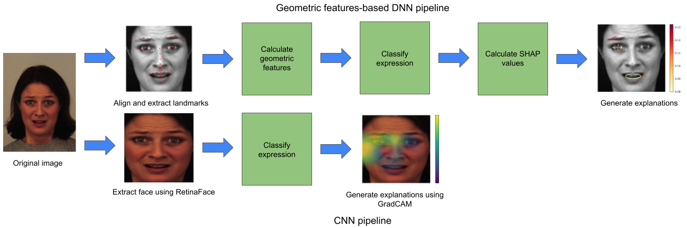

# Comparing Approaches for Explaining DNN-Based Facial Expression Classifications

You can find our paper [here](https://doi.org/10.3390/a15100367)

This repository contains all scripts used for the experiments from the paper.The scripts are split for the DNN experiments and the CNN experiments. Each script contains the functions used for a certain part of the experiment.


## Abstract
Classifying facial expressions is a vital part of developing systems capable of aptly interacting with users. In this field, the use of deep-learning models has become the standard. However, the inner workings of these models are unintelligible, which is an important issue when deploying them to high-stakes environments. Recent efforts to generate explanations for emotion classification systems have been focused on this type of models. In this work, an alternative way of explaining the decisions of a more conventional model based on geometric features is presented. We develop a geometric-features-based deep neural network (DNN) and a convolutional neural network (CNN). Ensuring a sufficient level of predictive accuracy, we analyze explainability using both objective quantitative criteria and a user study. Results indicate that the fidelity and accuracy scores of the explanations approximate the DNN well. From the performed user study, it becomes clear that the explanations increase the understanding of the DNN and that they are preferred over the explanations for the CNN, which are more commonly used. All scripts used in the study are publicly available.

## Explanation Generation Pipeline


## Cite
If you want to use this work, please consider citing the following:
```
@Article{a15100367,
AUTHOR = {ter Burg, Kaya and Kaya, Heysem},
TITLE = {Comparing Approaches for Explaining DNN-Based Facial Expression Classifications},
JOURNAL = {Algorithms},
VOLUME = {15},
YEAR = {2022},
NUMBER = {10},
ARTICLE-NUMBER = {367},
URL = {https://www.mdpi.com/1999-4893/15/10/367},
ISSN = {1999-4893},
DOI = {10.3390/a15100367}
}
```
